## Deploying Sharded Cluster through MongoDB Enterprise Operator For Kubernetes

MongoDB provides two operators for Kubernetes

- [Community Operator](https://github.com/mongodb/mongodb-kubernetes-operator)
    - Only supports deploying MongoDB Replica Sets.
- [Enterprise Operator](https://github.com/mongodb/mongodb-enterprise-kubernetes)
    - Supports Deploying
        - MongoDB Replica Sets
        - MongoDB Sharded Clusters
        - TLS Support

## MongoDB Ops Manager

- The Enterprise Kubernetes Operator requires access to one of MongoDB's database
management tools - `Ops Manager` or `Cloud Manager` - to deploy MongoDB instances.

- Ops Manager is MongoDB's enterprise management, monitoring and backup platform.
The Operator can install and manage Ops Manager in Kubernetes.
Ops Manager can manage MongoDB instances both inside and outside Kubernetes.

### Deploying MongoDB Ops Manager

#### Installing MongoDB Operator through Helm.

```bash
$ helm repo add mongodb https://mongodb.github.io/helm-charts
$ helm repo update
$ helm install enterprise-operator mongodb/enterprise-operator --namespace mongodb --create-namespace
# 👆 This creates mongodb namespace
```

#### Creating a secret for an admin user.

These are the details for the admin user that will be needed to Logging into
the Ops Manager

```bash
$ kubectl create secret generic ops-manager-secret \
  --from-literal=Username="<username>" \
  --from-literal=Password="<password>" \
  --from-literal=FirstName="<firstname>" \
  --from-literal=LastName="<lastname>"

# Replace all the <fields> in <> with respective values
```

Read more about the prerequisites [here](https://www.mongodb.com/docs/kubernetes-operator/master/tutorial/plan-om-resource/#om-rsrc-prereqs).

#### Deploying Ops Manager Resource

```yaml
# ops-manager.yaml
---
apiVersion: mongodb.com/v1
kind: MongoDBOpsManager
metadata:
  name: mongodb-ops-manager
spec:
  replicas: 1
  version: 6.0.0
  adminCredentials: ops-manager-secret # name of the previously created secret
  externalConnectivity:
    type: NodePort
  applicationDatabase: # this is the database that is used by the ops manager
    version: "4.4.11-ent"
    members: 3 # number of members in the replica set of the application database.
---
```

Read more about configuring Ops Manager [here](https://www.mongodb.com/docs/kubernetes-operator/master/tutorial/deploy-om-container/)

- Create Ops Manager Instance

```bash
$ kubectl apply -f ops-manager.yaml -n mongodb
```

- Track the status of Ops Manager instance

```bash
$ kubectl get om -o yaml -w
```

### Setting Up MongoDB Ops Manager.

- Use `kubectl get all -n mongodb` and look for `svc/mongodb-ops-manager-svc`
- Then port-forward the `svc/mongodb-ops-manager-svc` or use the configured `NodePort`

```bash
$ kubectl port-forward svc/mongodb-ops-manager-svc 8080:8080 -n mongodb
```
- Open `localhost:8080` (or `NodePort`) and the following page will appear.


- Login with the details provided during the creation of the `ops-manager-secret`

- Setup Ops Manager through the setup wizard. (You can change the values later.)

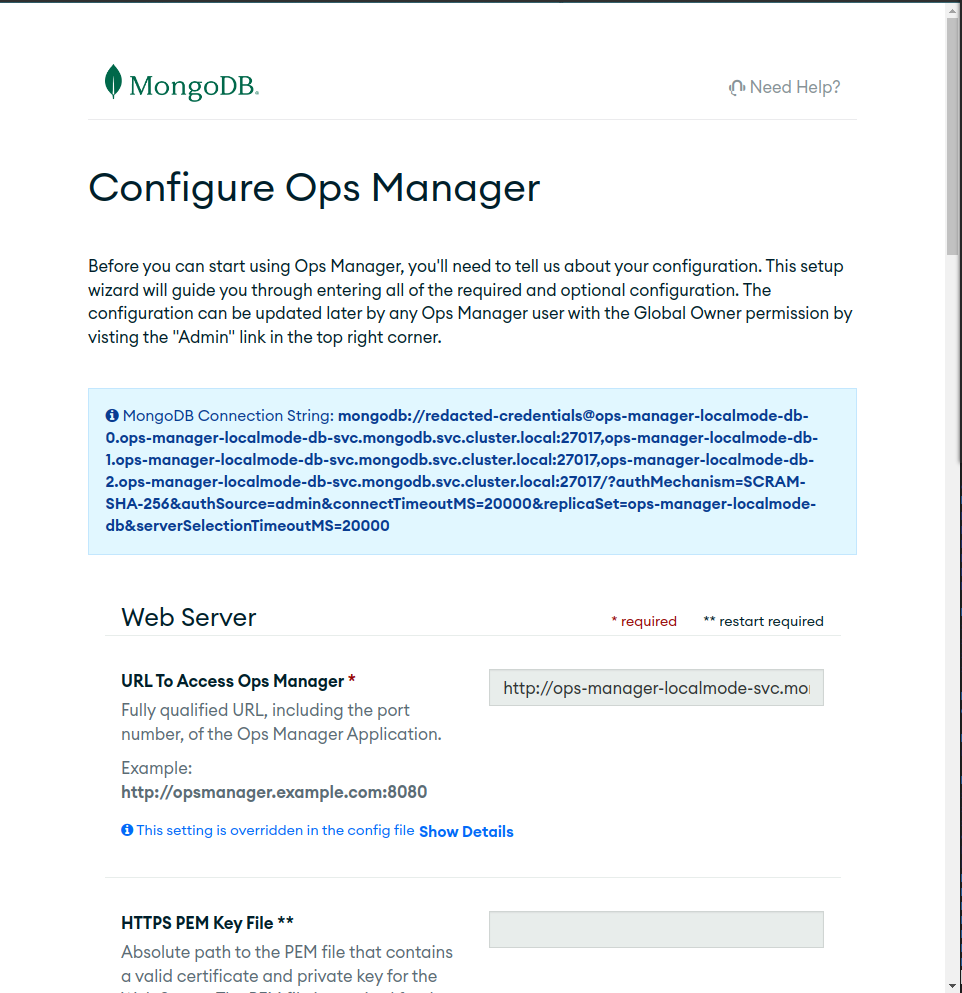

- On the Dashboard click on the organisation with the blue text.
(The organisation name can be different)

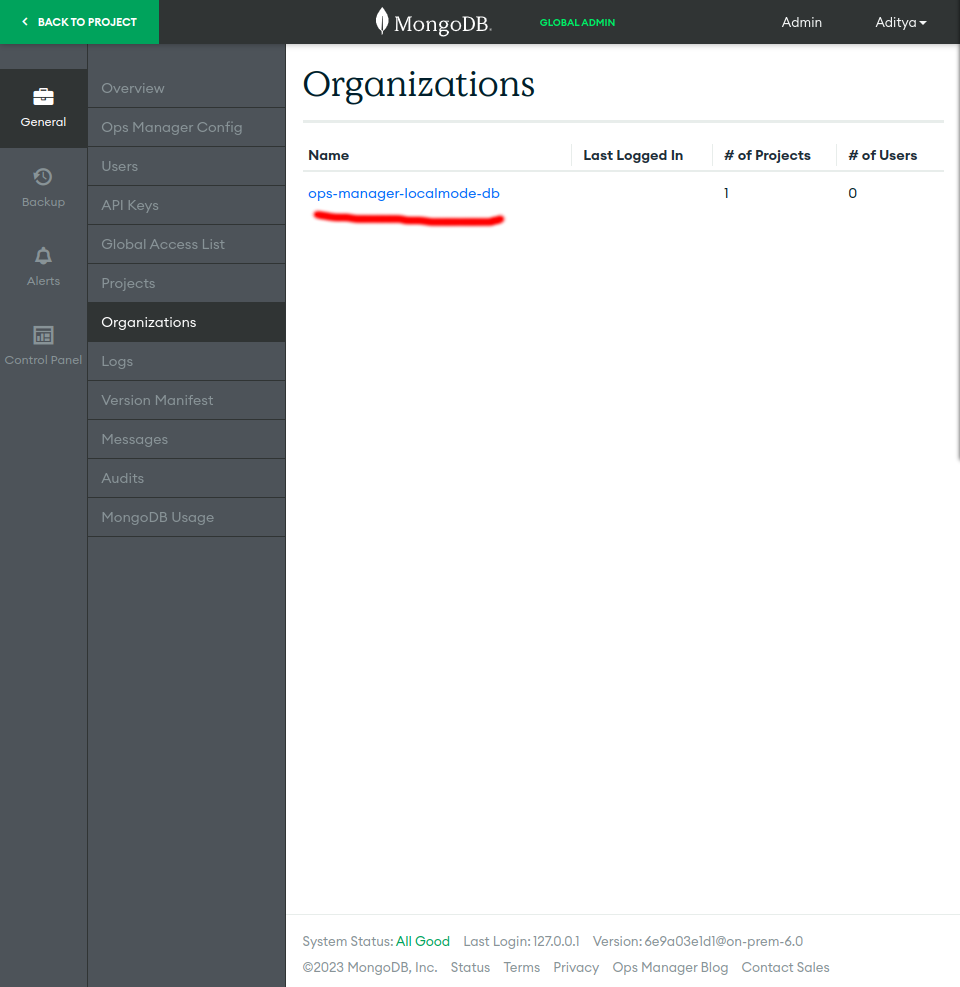

- On the Organisation Page on the top-left side click on `View All Organisations`
  And then create a new organisation.

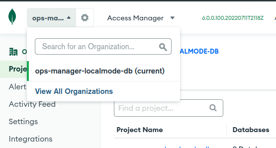

- In the New Organisation's Page click on `Access Manager` and on the top-right
side click on `Create API Key`

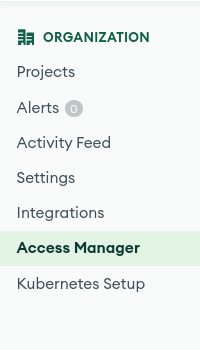
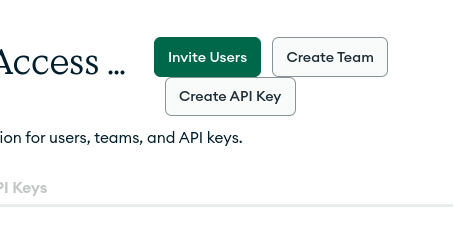

##### This is the `Programmatic API Key` that the enterprise operator will use to communicate with the Ops Manager for creating resources.

- On the `Create API Key` page add all available permissions and click Next.

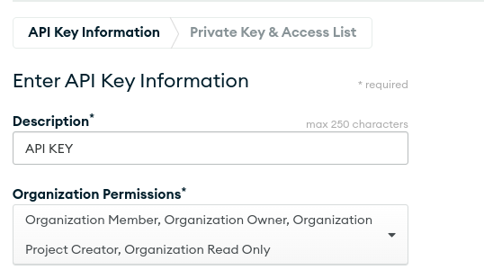


- On the Next Page copy the Public and Private API keys and then add the following
CIDR Notation to the Access List Entry

`10.0.0.0/8` (This will allow IPs from 10.0.0.1 to 10.255.255.254 to connect to
the Ops Manager.)

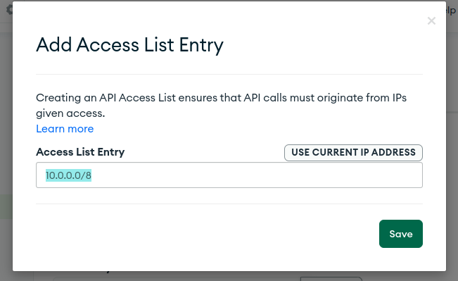
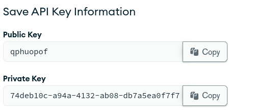

- Create a secret for the API keys.

```bash
$ kubectl -n mongodb \
create secret generic api-keys \
--from-literal="publicKey=qphuopof" \
--from-literal="privateKey=74deb10c-a94a-4132-ab08-db7a5ea0f7f7"
```
- Now create a project in the Organisation.

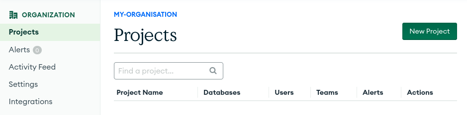

#### for e.g `my-project`
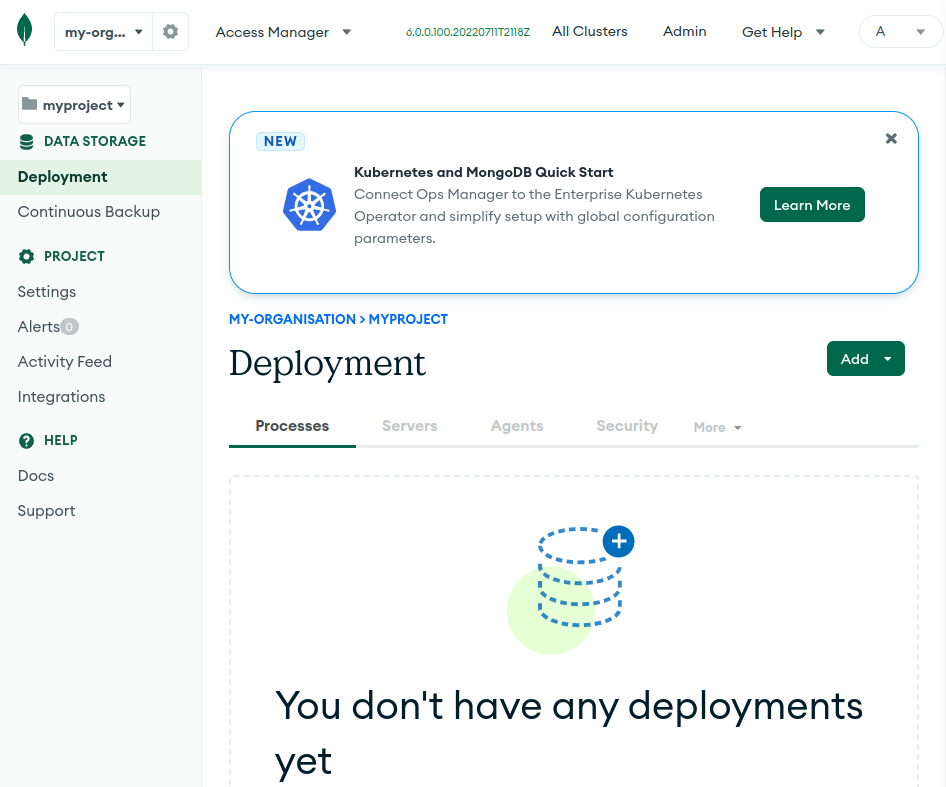

- Now Create a `ConfigMap` for the project.

```yaml
# project-config.yaml
apiVersion: v1
kind: ConfigMap
metadata:
  name: my-project
  namespace: mongodb
data:
  projectName: my-project # Should match the name of the project that you created.
  # Organisation ID from the OPS Manager Dashboard
  orgId: 642d5075038f061cd93def16
  baseUrl: http://mongodb-ops-manager-svc.mongodb.svc.cluster.local:8080
```

- Create the `ConfigMap`

```bash
$ kubectl apply -f project-config.yaml -n mongodb
```

##### Note: You can get the Organisation ID From the URL too.


## MongoDB Sharded Cluster

```yaml
# mongo-shard.yaml
---
apiVersion: mongodb.com/v1
kind: MongoDB
metadata:
  name: mongodb-shard
spec:
  shardCount: 2 # Number of Shards
  mongodsPerShardCount: 3 # Number of Mongod instances in each shard replica set
  mongosCount: 1 # Number of Mongos Instances
  configServerCount: 3 # Number of members in the config server replica set.
  version: "4.2.2-ent"
  opsManager:
    configMapRef:
      name: my-project # Previously created project name.
  credentials: api-keys # The Secret that contains API keys.
  type: ShardedCluster
  persistent: true
---
```

##### Note: MongoDB Enterprise Operator uses the default storage class of the cluster.

```bash
$ kubectl apply -f mongo-shard.yaml -n mongodb
```

The Above configuration will create

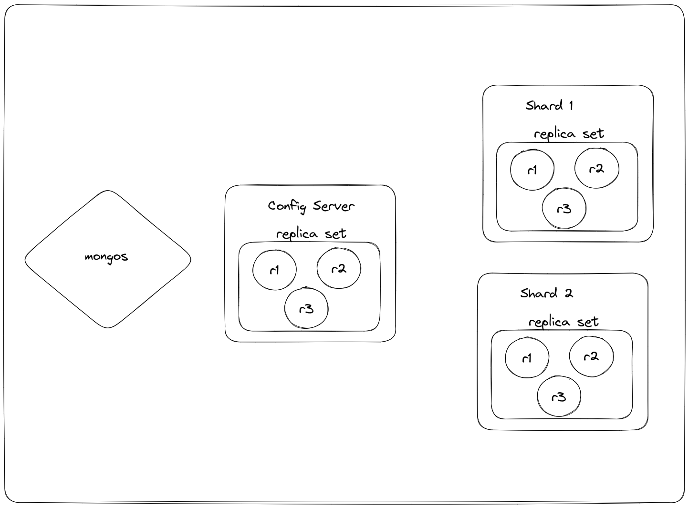

- Track the status of Sharded Cluster through

```bash
$ kubectl get mdb -n mongodb mongodb-shard -o yaml -w
```

- Read more about configuring sharded cluster [here](https://www.mongodb.com/docs/kubernetes-operator/master/tutorial/deploy-sharded-cluster/)


## References

- https://www.mongodb.com/docs/kubernetes-operator/master/tutorial/deploy-sharded-cluster/
- https://www.mongodb.com/docs/kubernetes-operator/master/tutorial/deploy-om-container/
